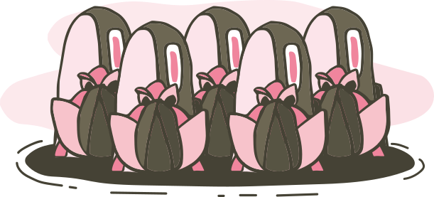

# Dammen - Interaktiv webbsida

Ett grafiskt interaktivt projekt där en fisk reagerar på klick och hovring med animationer och ljud.

## Projektstruktur

```
Dammen/
├── index.html          # Huvudfilen för webbsidan
├── css/
│   └── style.css      # All styling och animationer
├── js/
│   └── main.js        # Interaktivitet och ljudhantering
├── assets/
│   ├── images/        # Fiskbild(er) (PNG/SVG)
│   └── sounds/        # Ljudfiler (MP3/WAV)
└── README.md          # Denna fil
```

## Hur du använder projektet

### 1. Lägg till din bild
Placera din fiskbild i mappen `assets/images/`:
- `Dammen_bilder.svg`

Du kan använda SVG eller PNG med transparent bakgrund för bäst resultat.

### 2. Lägg till dina ljudfiler
Placera dina jingel-ljudfiler i `assets/sounds/` mappen:
- `jingle1.mp3`
- `jingle2.mp3`
- `jingle3.mp3`
- `jingle4.mp3`

MP3-format rekommenderas för bred webbläsarkompatibilitet.

### 3. Öppna sidan

#### I VS Code:
1. Högerklicka på `index.html`
2. Välj "Open with Live Server" (om du har tillägget Live Server)
  - Om du saknar det, installera tillägget "Live Server" från Extensions Marketplace

#### I webbläsare:
1. Högerklicka på `index.html` i VS Code
2. Välj "Reveal in Finder"
3. Dubbelklicka på `index.html` för att öppna i din standardwebbläsare

Alternativt, dra och släpp `index.html` direkt till din webbläsare.

## Funktioner

- **Hover-effekt**: När du håller musen över en fisk vickar den och blir lite större
- **Klick-effekt**: När du klickar på en fisk:
  - Fisken studsar med en animation
  - En jingel spelas
  - Extra bubblor skapas
- **Bubblor**: Kontinuerliga bubblor animeras uppåt i dammen

## Animationer (hur de fungerar)

Den mesta rörelsen ligger direkt i SVG-filen `assets/images/Dammen_bilder.svg` via `animateTransform`.

### Molnens rörelse

Molnen rör sig horisontellt fram och tillbaka i en loop (`repeatCount="indefinite"`):

- `Moln_topp`: `values="0 0; 30 0; 0 0"`, `dur="6s"`
  - Rör sig 30 px åt höger och tillbaka på 6 sekunder.
- `Moln_vänster`: `values="0 0; 35 0; 0 0"`, `dur="8s"`
  - Rör sig 35 px åt höger och tillbaka på 8 sekunder.
- `Moln_höger_group`: `values="0 0; -30 0; 0 0"`, `dur="7s"`
  - Rör sig 30 px åt vänster och tillbaka på 7 sekunder.

Det gör att molnen driver i olika takt och riktning, vilket ger en lugn parallax-känsla.

### Interaktiv animation i JavaScript

I `js/main.js` laddas SVG:en in via `<object id="dammen-svg">`, och varje plats (`1` till `5`) får klick- och hoverbeteende:

- Klick växlar till nästa grupp i ordning (stängd näckros, öppen näckros, stor gren, liten gren, rosfisk, långfisk).
- Hover på aktiv grupp lyfter objektet med `translateY(-8px)`.

All växling sker genom att visa en grupp i taget (`display: inline`) och dölja övriga (`display: none`).

## Anpassning

### Byt fiskbild
I `index.html`, uppdatera bildsökvägen i fish-diven:
```html
<div class="fish" data-sound="assets/sounds/jingle1.mp3">
    
</div>
```

### Ändra färger
I `css/style.css`, ändra färgerna i gradienterna:
- Bakgrund: `.body` gradient
- Damm: `.pond` gradient

### Ändra animationer
Justera animationstider och effekter i `css/style.css` under `@keyframes`.

## Tekniker som används

- **HTML5**: Semantisk struktur
- **CSS3**: Grid-layout, animationer och gradients
- **JavaScript**: Event listeners, DOM-manipulation och Audio API

## Webbläsarkompatibilitet

Fungerar i alla moderna webbläsare:
- Chrome/Edge (senaste versionen)
- Firefox (senaste versionen)
- Safari (senaste versionen)

## Tips

- Använd transparenta SVG- eller PNG-bilder för bäst resultat
- Håll ljudfilerna korta (1–2 sekunder) för snabbare laddning
- Optimera bilderna för webben (max 200–300 px bredd)

Lycka till med ditt projekt! 🐟
